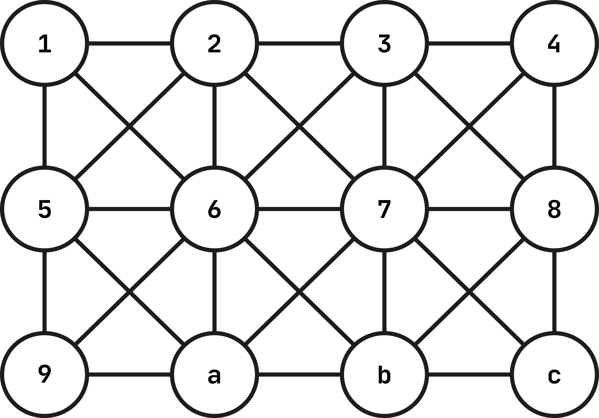
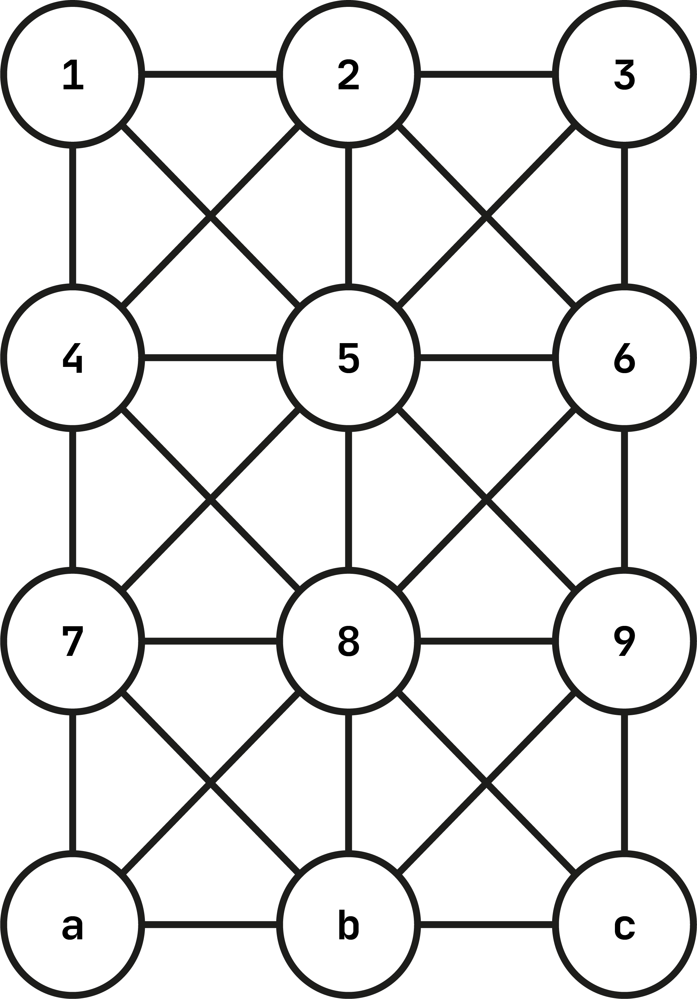
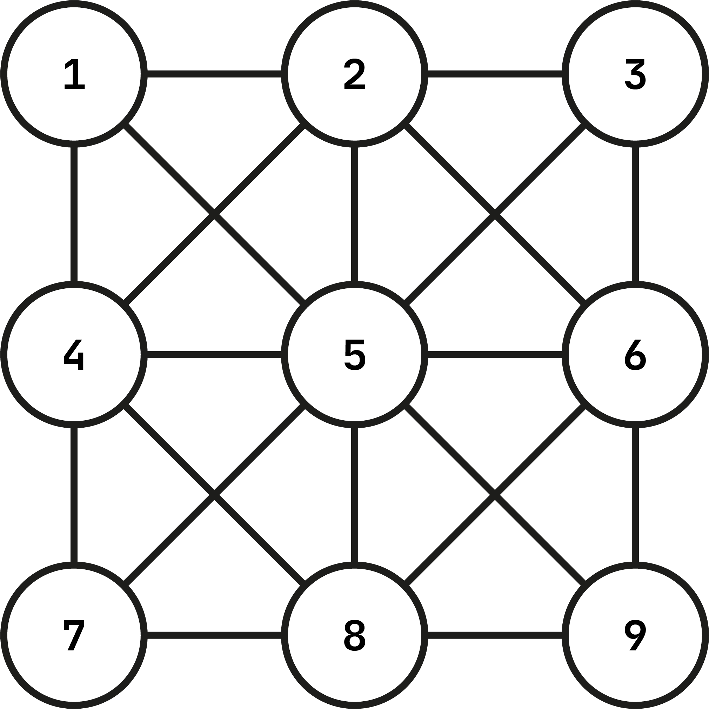

# Create dense lattice graph

- [Description](#description)
- [Overview of the returned value](#overview-of-the-returned-value)
- [Usage](#usage)
    - [Create a wide dense lattice graph](#create-a-wide-dense-lattice-graph)
    - [Create a tall dense lattice graph](#create-a-tall-dense-lattice-graph)
    - [Create a square dense lattice graph](#create-a-square-dense-lattice-graph)- 

## Description
This npm repository export a function `createDenseLatticeGraphAdjacencyList(width: int, height: int)`.  
The function returns a `Object<string, Array<[string, number]>>`.  
The function, given two integers `width` and `height`, both expressed in number of nodes, returns a 
[lattice graph](https://en.wikipedia.org/wiki/Lattice_graph) where the nodes are also connected diagonally rather than 
only horizontally and vertically.  
This is why, in this context, it is called *dense* lattice graph.

## Overview of the returned value
An example of the value returned by the exported function is the following:

```javascript
{
  "1": [ 
    ["5", 1], 
    ["2", 1],
    ["6", 1.4142135623730951]
  ],
  "2": [
    ["6", 1],
    ["1", 1],
    ["3", 1],
    ["7", 1.4142135623730951],
    ["5", 1.4142135623730951]
  ],
  "3": [
    ["7", 1],
    ["2", 1],
    ["4", 1],
    ["8", 1.4142135623730951],
    ["6", 1.4142135623730951]
  ],
  "4": [
    ["8", 1],
    ["3", 1],
    ["7", 1.4142135623730951]
  ],
  "5": [
    ["9", 1],
    ["1", 1],
    ["6", 1],
    ["a", 1.4142135623730951],
    ["2", 1.4142135623730951]
  ],
  "6": [
    ["a", 1],
    ["2", 1],
    ["5", 1],
    ["7", 1],
    ["b", 1.4142135623730951],
    ["9", 1.4142135623730951],
    ["1", 1.4142135623730951],
    ["3", 1.4142135623730951]
  ],
  "7": [
    ["b", 1],
    ["3", 1],
    ["6", 1],
    ["8", 1],
    ["c", 1.4142135623730951],
    ["a", 1.4142135623730951],
    ["2", 1.4142135623730951],
    ["4", 1.4142135623730951]
  ],
  "8": [
    ["c", 1],
    ["4", 1],
    ["7", 1],
    ["b", 1.4142135623730951],
    ["3", 1.4142135623730951]
  ],
  "9": [
    ["5", 1],
    ["a", 1],
    ["6", 1.4142135623730951]
  ],
  "a": [
    ["6", 1],
    ["9", 1],
    ["b", 1],
    ["5", 1.4142135623730951],
    ["7", 1.4142135623730951]
  ],
  "b": [
    ["7", 1],
    ["a", 1],
    ["c", 1],
    ["6", 1.4142135623730951],
    ["8", 1.4142135623730951]
  ],
  "c": [
    ["8", 1],
    ["b", 1],
    ["7", 1.4142135623730951]
  ]
}
```

For example, in the graph represented by the adjacency list above, node `"1"` will be connected to node
`"5"`, `"2"` and `"6"`,  with costs respectively set to `1`, `1` and `1.4142135623730951`, node `"6"` cost 
is set to `1.414213623730951` (square root of 2) because is the one connected diagonally.

In general, the returned value will be in the form: 
```javascript
{
  ...
  "hexadecimal-stringified-number-representing-a-node-name": [ 
    ["hexadecimal-stringified-number-representing-a-neighbour-node-name", 1], // this costs 1 because is connected horizontally or vertically 
    ["hexadecimal-stringified-number-representing-a-neighbour-node-name", 1], 
    ["hexadecimal-stringified-number-representing-a-neighbour-node-name", 1], 
    ["hexadecimal-stringified-number-representing-a-neighbour-node-name", 1.4142135623730951]  // this costs 1 because is connected diagonally
  ],
  ...
}
```
As sayed before, node names are stringified hexadecimal numbers starting from "1".

Few examples:

| nth node | node name |
|----------|-----------|
| 1        | "1"       |
| 2        | "2"       |
| 3        | "3"       |
| 10       | "a"       |
| 11       | "b"       |
| 16       | "10"      |


## Usage
By modifying the parameters one can create wide, tall or square dense lattice graphs.

#### Create a wide dense lattice graph
A wide dense lattice graph is a dense lattice graph with more node on its length than the ones on its height.

```javascript
const {createDenseLatticeGraphAdjacencyList} = require("./where/did/you/put/this");

const graph = createDenseLatticeGraphAdjacencyList(4, 3);
```
A data structure that can be represented by the following image has been returned and assigned to `graph`.



#### Create a tall dense lattice graph
A tall dense lattice graph is a dense lattice graph with less node on its length than the ones on its height.

```javascript
const {createDenseLatticeGraphAdjacencyList} = require("./where/did/you/put/this");

const graph = createDenseLatticeGraphAdjacencyList(3, 4);
```
A data structure that can be represented by the following image has been returned and assigned to `graph`.



#### Create a square dense lattice graph
A square dense lattice graph is a dense lattice graph with the same amount of node on its height and on its length.

```javascript
const {createDenseLatticeGraphAdjacencyList} = require("./where/did/you/put/this");

const graph = createDenseLatticeGraphAdjacencyList(3, 3);
```
A data structure that can be represented by the following image has been returned and assigned to `graph`.

